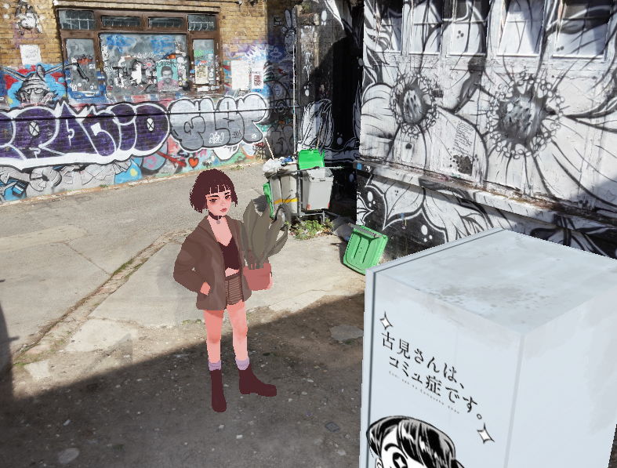

# 🌊 OpenGL GLTF scene manager 🌊

Simple gltf scene manager for OpengGL (3.3+). 
Easy to build up upon it. Use it as you wish.

## How to use

**WASD + Mouse** - movement 
**Esc** - quit 
**F5** - reload scene file (only transforms for now) 

How to setup scene: there is "scene_setup.json" file. 
-> "models" - json-array of models paths (strings) 
-> "transform" - json-array of tranforms for each model 
----> "pos" - translate (position in world) 
----> "rot" - rotation (degrees) 
----> "scl" - scale 

## Supported
* Textures
* Samplers (min, mag, wrap_s, wrap_t)
* Multiple meshes per model
* Materials (*partially)
* Model transformation
* Mipmaps

## Not supported/tested yet
* PBR (roughness, metallic, normal maps ect...)
* Animations 
* Bézier surfaces

## Dependency 
- glad (v3)
- glfw3
- stb_image
- stb_image_write
- [tiny_gltf](https://github.com/syoyo/tinygltf)
- [json](https://github.com/nlohmann/json) (by nlohmann)

## Models in scene preview
- [Matilda](https://sketchfab.com/3d-models/matilda-7ddedfb652bd4ea091bc3de27f98fc02) by nicolekeane
- [Komi-san VM](https://sketchfab.com/3d-models/komi-san-vending-machine-a92562fa756e44bba9d2f5904e1c2432) by Mikail Karaca
- [Seven Stars Brick Lane](https://sketchfab.com/3d-models/seven-stars-brick-lane-9a16438ddcd34a51a9e3b04e0ab04be7) by artfletch

## Licenses
Created by Nick Nishort - [github](https://github.com/Jill-of-All-Trades) 
* This is licensed under [Creative Common BY 4.0](https://creativecommons.org/licenses/by/4.0/)
* TinyGLTF : MIT license
* json.hpp : Copyright (c) 2013-2017 Niels Lohmann. MIT license
* stb_image.h : v2.08 - public domain image loader 
* stb_image_write.h : v1.09 - public domain image writer
* glfw - [zip/libpng license](https://www.glfw.org/license.html) 